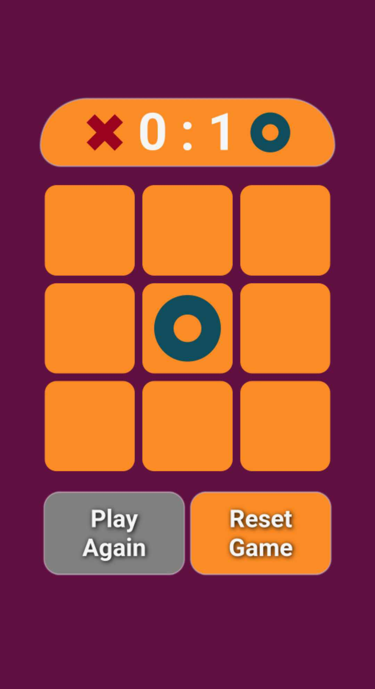

# TicTacToe
TicTacToe created by Patryk 'UltiPro' Wójtowicz using JavaScript.

Tic tac toe game written in JavaScript. Game offers two modes. Player mode which allows to play by two players and computer mode which allows to play against computer. Game has scoreboard. Reset button changes mode and resets scoreboard. Play again button starts game again.

# Preview

    
    
    

    
    
    

